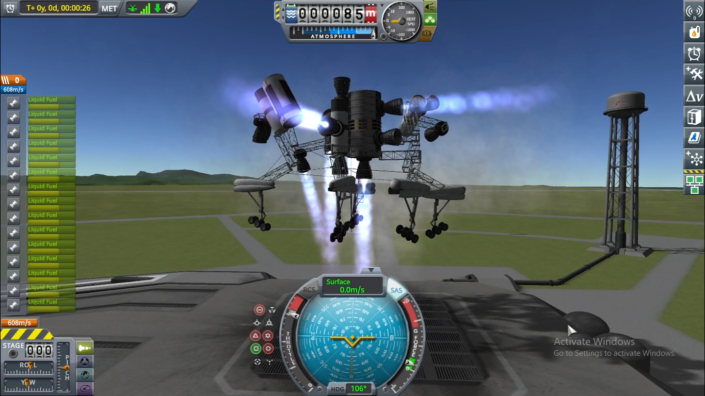
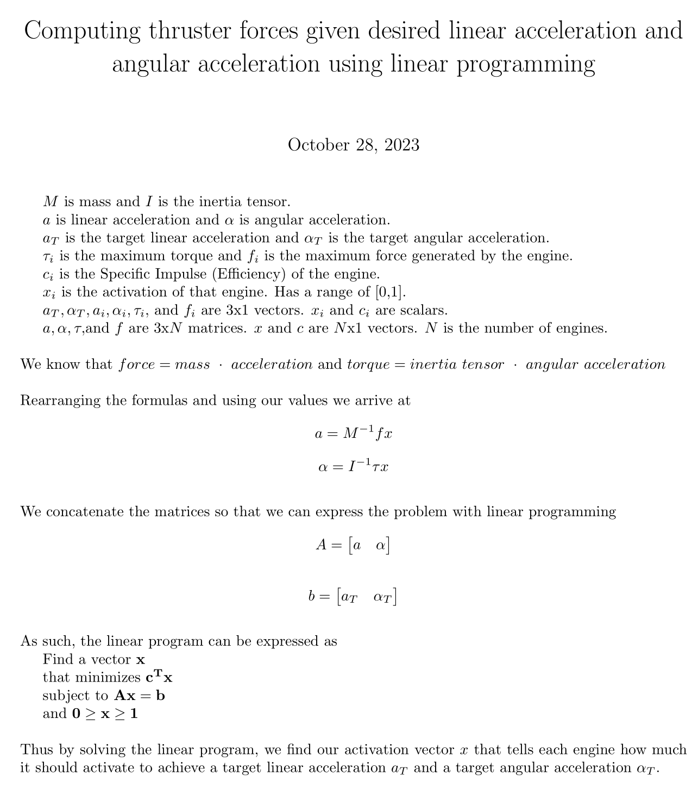

# Inertia drone control
Calculates necessary forces of each thruster to achieve a target linear acceleration and angular acceleration  

https://github.com/gustavomoura628/krpc/assets/88595534/b32ed5b2-0c34-400a-b16b-21df5a4c4214

